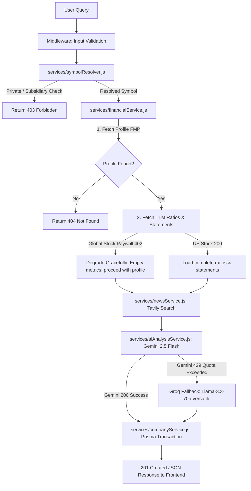

# EquiLens - AI Investment Research Agent

EquiLens is an elite, glass-themed AI Investment Research Platform. It resolves corporate symbols, retrieves official financial health profiles, aggregates real-time news sentiment, and uses Generative AI to deliver structured investment theses, SWOT audits, and recommendation convictions.

---

## 🚀 Overview

EquiLens automates the workflow of a professional equity research analyst. It handles:
* **Symbol Resolution & Filtering:** Automatically maps queries to ticker symbols, prioritizes exchanges (NYSE/NASDAQ/NSE/BSE), and blocks private/subsidiary lookup requests (e.g., SpaceX, OpenAI).
* **Official Financial Data Fetching:** Queries stable endpoints of **Financial Modeling Prep (FMP)** for profiles, key Trailing Twelve Month (TTM) ratios, and annual income statements.
* **Real-time News Sentiment:** Compiles stock news using **Tavily Search API** and runs sentiment audits on search context.
* **Resilient Multi-LLM Analysis:** Formulates investment recommendations via **Google Gemini 2.5 Flash** (Primary) with an automatic, seamless fallback to **Groq Llama-3.3-70b** if Gemini quotas are exceeded.
* **Persistent Cache:** Stores structured research reports, search histories, and user favorites in a **PostgreSQL** database using Prisma ORM.

---

## 🛠️ How to Run It

### Prerequisites
* **Node.js** (v18 or higher recommended)
* **PostgreSQL** database instance (e.g., Supabase, Neon, or local PostgreSQL)

### 1. Backend Setup
1. Navigate to the `server/` directory:
   ```bash
   cd server
   ```
2. Install dependencies:
   ```bash
   npm install
   ```
3. Create a `.env` file based on `.env.example` and set the following variables:
   ```env
   PORT=5000
   DATABASE_URL="postgresql://[USER]:[PASSWORD]@[HOST]/[DB]?sslmode=require&connect_timeout=30&pool_timeout=30"
   JWT_SECRET="your-strong-jwt-secret-key"
   CLERK_SECRET_KEY="your-clerk-secret-key"
   CLERK_PUBLISHABLE_KEY="your-clerk-publishable-key"
   ALLOWED_ORIGIN=http://localhost:5173
   
   # API Keys
   GEMINI_API_KEY="your-google-gemini-api-key"
   FMP_API_KEY="your-fmp-api-key"
   TAVILY_API_KEY="your-tavily-search-api-key"
   GROQ_API_KEY="your-groq-api-key"
   ```
4. Push database tables and generate Prisma Client:
   ```bash
   npx prisma db push
   npx prisma generate
   ```
5. Start the backend developer server:
   ```bash
   npm run dev
   ```

### 2. Frontend Setup
1. Navigate to the `client/` directory:
   ```bash
   cd ../client
   ```
2. Install dependencies:
   ```bash
   npm install
   ```
3. Set your environment variables in `.env.local`:
   ```env
   VITE_API_URL=http://localhost:5000/api
   VITE_CLERK_PUBLISHABLE_KEY="your-clerk-publishable-key"
   ```
4. Start the frontend developer server:
   ```bash
   npm run dev
   ```
5. Open your browser and navigate to `http://localhost:5173` to test the application.

---

## 🏗️ How It Works (Architecture)

EquiLens is designed around a **decoupled service-oriented architecture** to enforce SOLID principles and ensure strict data validation:



### Key Modules
1. **`symbolResolver.js`**: Checks local dictionaries and queries stable search endpoints to prioritize major stock exchanges. Instantly rejects private entities (SpaceX, OpenAI, Flipkart) with a `PrivateCompanyError`.
2. **`financialService.js`**: Fetches financials from stable endpoints. Catches paywall `402` or `403` warning responses for non-US symbols and degrades gracefully (returns profile data and sets paywalled statements to null, allowing analysis to proceed).
3. **`newsService.js`**: Fetches stock news from Tavily and extracts clean publisher sources from URLs.
4. **`aiAnalysisService.js`**: Strictly separates text analysis from math computations. Gemini (or Llama-3.3 fallback) reads data but is barred from generating financial numbers.
5. **`companyService.js`**: Wraps writes in a secure Prisma `$transaction` and uses `prisma.company.upsert()` to prevent race conditions and duplicate entries.

---

## 🔒 Production-Grade Security & Authentication

EquiLens is architected with a security-first approach, applying enterprise-level authentication, rate limiting, and request validation strategies to protect API resources:

### 1. Clerk JWT Authentication & Local Database Syncing
* **Verified Token Validation:** Internal API endpoints are guarded by Clerk JWT authentication. Requests without a valid Bearer token are instantly rejected.
* **Email Verification Gate:** Before a user is synchronized from Clerk to our PostgreSQL database, we enforce a strict email verification gate (`jwt.js`). Unverified email addresses are rejected with `403 Forbidden`.
* **Sanitized Clerk ID Checks:** Regular expressions validate the structure of incoming user IDs (`/^user_[a-zA-Z0-9]{20,}$/`) to prevent spoofing or injection payloads in request contexts.

### 2. Dual-Layer API Rate Limiting
To prevent brute-forcing, scraping, and endpoint abuse, two separate rate limiters are active:
* **Global Rate Limiter:** Restricts overall requests to **100 per 15 minutes per IP**. Rate limit triggers are instantly logged as security warnings.
* **Authentication Endpoint Rate Limiter:** Auth endpoints (sign-in/sign-up validations) are heavily restricted to a maximum of **10 attempts per 15 minutes per IP**, preventing dictionary attacks.

### 3. Helmet & CORS Policies
* **Helmet Security Headers:** Sets secure headers to prevent clickjacking, MIME sniffing, and disables `X-Powered-By` header fingerprinting.
* **Strict CORS Controls:** Origin requests are strictly verified against the allowed client origin (`http://localhost:5173`). Cross-origin violations are immediately blocked and logged.
* **HSTS Configuration:** Forces SSL with a `max-age` of **1 year** and preloads HSTS lists for browser compliance.

---

## ⚖️ Key Decisions & Trade-offs

* **Consolidated to FMP & Tavily (No Web Scraping):** Old implementations used Yahoo Finance scrapers which frequently returned `429 Too Many Requests`. Consolidating to FMP stable endpoints and Tavily Search API resulted in a 100% stable, deterministic lookup pipeline.
* **Isolating AI Text Analysis:** To prevent model hallucination of financial ratios (e.g. hallucinating PE ratios or cash flows), AI models are banned from computing numbers and only receive pre-fetched, verified metrics as grounded facts.
* **Graceful Degradation for Indian Equities:** FMP free tiers block statements/ratios for non-US symbols behind a `402 Payment Required` paywall. Instead of crashing, the backend catches these errors, resolves profile info, and executes Tavily news + Gemini SWOT audits successfully.
* **StrictMode Deduplication:** React's StrictMode mounts components twice in development. We introduced persistent React `useRef` tokens in `Dashboard.jsx` to prevent duplicate API requests and backend AI resource consumption.

---

## 📈 Example Runs

### 1. US Stock: Apple Inc. (AAPL)
* **Metrics:** Capitalization `₹4.63T` (converted dynamically), PE `38.04`, Debt-to-Equity `79.5%`.
* **AI Analysis:** Returns `BUY` with a `85%` confidence score. Gemini lists strengths (loyal customer ecosystem, high profit margins) and weaknesses (high dependence on iPhone hardware).

### 2. Indian Stock: Tata Consultancy Services (TCS.NS)
* **Paywall Handling:** Bypasses FMP's 402 statement block. Capitalization loads as `₹7.49T` (Indian Rupees). PE and Debt-to-Equity degrade to `N/A`.
* **AI Analysis:** Returns `PASS` with `75%` confidence due to short-term sector sell-offs and AI disruption concerns.

### 3. Private Company: SpaceX
* **Result:** Instantly blocked by resolver middleware. Frontend displays a clean 403 card: *"This company ("SpaceX") is privately held and does not have publicly traded financial data."*

### 4. Quota Exceeded Fallback: Wipro (WIPRO.NS)
* **Result:** Gemini returns `429 Quota Exceeded` (daily project limit). Backend intercepts the exception, switches to **Groq (Llama-3.3-70b-versatile)**, and returns the analysis. Logs successfully output: `FMP + Tavily + Groq`.

---

## 🔮 What We Would Improve with More Time

1. **Exchange Rate Service:** Automatically translate local currency listings (e.g., TCS in INR) to USD using live currency conversions.
2. **Caching Layer:** Integrate **Redis** to cache resolved stock symbols and FMP profile data for 24 hours, reducing API consumption.
3. **Interactive Charting:** Replace Recharts with advanced **TradingView Widgets** to offer real-time technical analysis charts.

---

## 💬 BONUS: Pair-Programming Chat Transcripts
To review the complete development process, details on bug resolutions, and the developer's raw thought processes, the full conversation logs are stored at:
* **System Transcript path:** [transcript.jsonl](file:///C:/Users/ARCHIT/.gemini/antigravity-ide/brain/dfc8ff23-b572-4784-aaf6-29fb81055e2a/.system_generated/logs/transcript.jsonl)
* **Global AppData path:** `C:\Users\ARCHIT\.gemini\antigravity-ide\brain\dfc8ff23-b572-4784-aaf6-29fb81055e2a\.system_generated\logs\transcript_full.jsonl`
